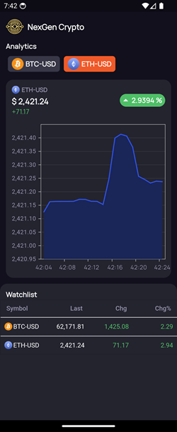
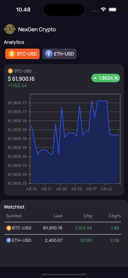

# Dokumentasi Project

## `Versioning`

- **Flutter**: 3.16.4
- **JDK**: 19.0.2
- **Platform**: Android & iOS

## `Link Download`

- [Unduh APK NexGen Crypto](https://bit.ly/apk_nexgenCrypto)

## `Screenshoot`

### Android

### Ios

## `Dependencies`

- **google_fonts: 6.1.0**
  Menggunakan gfont sebagai font aplikasi.

- **flutter_bloc: ^8.1.6**
  State Management.
- **equatable: ^2.0.5**
  Perbandingan objek.

- **web_socket_channel: ^2.4.0**
  Alat komunikasi real-time dengan server melalui WebSocket.

- **syncfusion_flutter_charts: ^22.2.10**
  Visualisasi data jenis grafik.

- **syncfusion_flutter_datagrid: ^22.2.10**
  Menampilkan data dalam format tabel atau grid.

- **intl: ^0.18.0**
  Lokalisasi untuk format tanggal dan angka.

- **shimmer: ^3.0.0**
  Efek loading.

## `HistorycalPage`

## Fitur Utama

- **Koneksi WebSocket**: Secara otomatis subcribe / unsub WebSocket berdasarkan appLifecycleState.
- **Tampilan Data**: Header dengan logo aplikasi dan judul dan daftar cryptocurrency.
- **Charting Grafik**: Menggunakan syncfusion_flutter_charts untuk menampilkan data dari cryptocurrency yang dipilih.
- **Watchlist**: Menampilkan daftar data, termasuk simbol, harga terakhir, perubahan, dan persentase perubahan.

## AppLifecycleState

- **WidgetsBindingObserver**: Pengamat lifecycle aplikasi.
- **Pencatatan**: Mencatat transisi status aplikasi untuk tujuan proses lanjut atau berhenti stream WebSocket.

## `WebSocket`

`HistorycalDatasource` mengatur koneksi WebSocket untuk berkomunikasi dengan server secara real-time.

1. **Variabel:**

   - **`WebSocketChannel? _channel`**: Inisialisasi WebSocket.
   - **`StreamController<String> _streamController`**: Pengelolaan aliran stream WebSocket.
   - **`Stream<String> get messages`**: Penerimaan message dari stream.

2. **Metode Utama:**
   - **`void connect(String url)`**: Menghubungkan ke server WebSocket dan mendengarkan pesan yang datang dan menambahkannya ke stream.
   - **`void sendMessage(String message)`**: Mengirim pesan ke server.
   - **`void _disconnect()`**: Menutup koneksi WebSocket .
   - **`void dispose()`**: Bersihkan semua resource.

## `HistorycalBloc`

1. **Deskripsi Umum**
   `HistorycalBloc` state management untuk mengelola data historis dari WebSocket. Menghubungkan app dengan server dan menerima data secara real-time.

2. **Event dan State**

   - Menggunakan event seperti `ConnectHistorycalWebSocket`, `SubscribeToHistorycalWebSocket`, `UnsubscribeToHistorycalWebSocket`, dan `ReceiveMessageHistorycalWebSocket` untuk mengelola alur data dan pembaruan state.
   - Menggunakan state `HistorycalInitial` dan `HistorycalWebSocketMessageLoaded` untuk menandakan status data yang diterima.

3. **Function**
   - **`_connectHistorycalWebSocket`**: Menghubungkan ke server WebSocket.
   - **`_subscribeToHistorycalWebSocket`**: Mengirim pesan untuk subscribe data.
   - **`_unsubscribeToHistorycalWebSocket`**: Mengirim pesan untuk berhenti subsribce.
   - **`_receiveMessageHistorycalWebSocket`**: Menerima dan memproses pesan dari WebSocket, memperbarui data.
   - **`updateData`**: Memelihara data yang disimpan dengan menghapus data lama dan memperbarui grafik jika jumlah data melebihi batas yang ditentukan (30).
   - **`onDataReceived`**: Memeriksa dan memverifikasi apakah data baru yang diterima valid berdasarkan perbedaan waktu dengan data lama.

## `WatchlistDatasource`

`WatchlistDatasource` adalah class untuk menampilkan data ke dalam bentuk tabel menggunakan `Syncfusion DataGrid`.

## Bagian Utama

1. **Variabel:**

   - **`List<DataGridRow> _historycalData`**: Menyimpan data historis yang sudah diubah menjadi baris grid.

2. **Constructor:**

   - **`WatchlistDatasource({required List<HistorycalModel> historycalData})`**: Menerima daftar `HistorycalModel` dan mengonversi setiap item ke dalam bentuk `DataGridRow`.

3. **Metode Utama:**
   - **`List<DataGridRow> get rows`**: Mengembalikan daftar baris yang sudah disiapkan untuk grid.
   - **`DataGridRowAdapter? buildRow(DataGridRow row)`**: Membuat tampilan visual untuk setiap baris. Menggunakan widget `Container` untuk mengatur tata letak dan penampilan sel-sel berdasarkan jenis data.
   - **`TextStyle getTextStyle(DataGridCell<dynamic> dataGridCell)`**: Mengatur gaya teks untuk setiap sel. Mengubah warna teks berdasarkan nilai perubahan, untuk menunjukkan apakah nilai naik atau turun.
